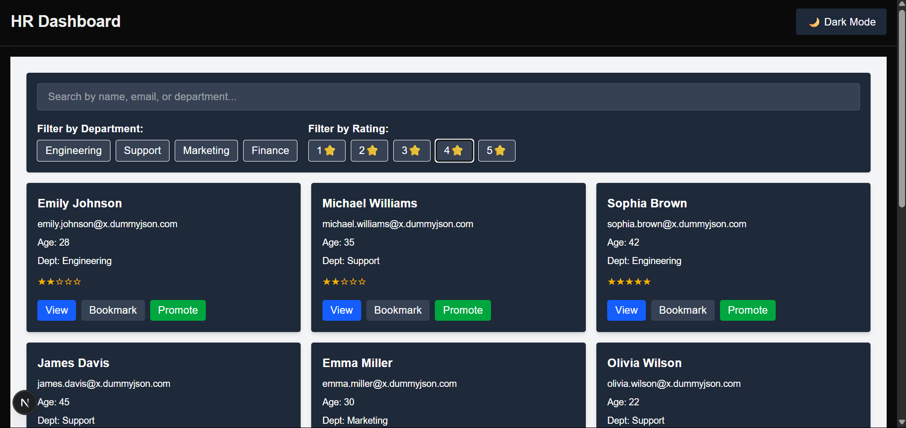
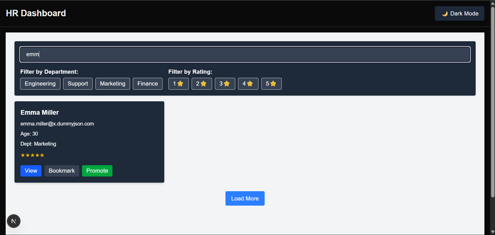
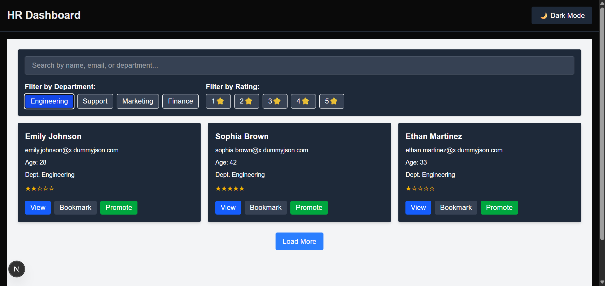
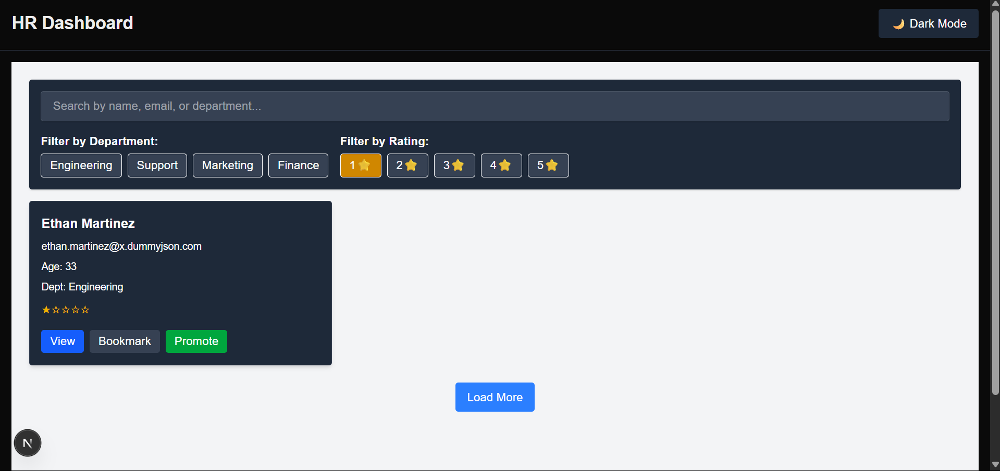
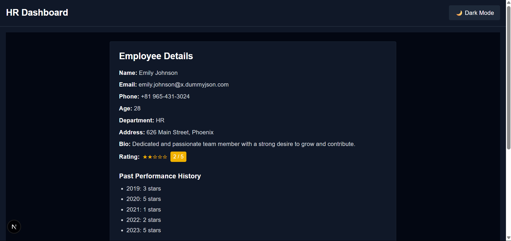
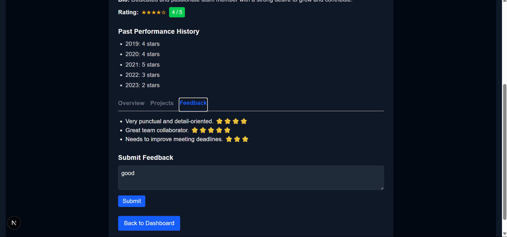
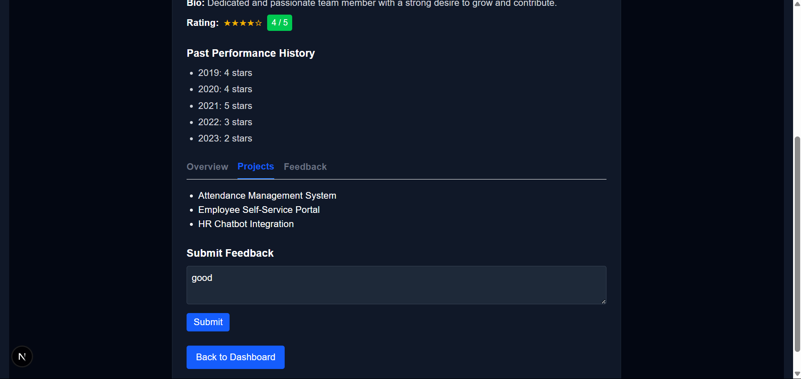
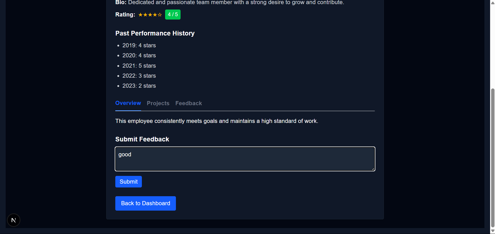

# HR Performance Dashboard

A modern HR Dashboard built with Next.js, TypeScript, Tailwind CSS, and Zustand. It allows HR teams to track employee performance, manage filters, view detailed employee profiles, and switch between dark and light mode.

---

## 🚀 Features Implemented

- 🌗 **Dark & Light Mode** toggle using `next-themes`
- 🔍 **Search and Filter Bar** for departments and ratings
- ⭐ **Rating System** with visual stars
- 📌 **Bookmark Employees** using Zustand state management
- 👁️ **View Details Page** for each employee
- 📊 **Responsive Design** using Tailwind CSS

---

## 🛠 Setup Instructions

### 1. Clone the Repo

git clone https://github.com/your-username/hr-performance-dashboard.git
cd hr-performance-dashboard

### 2.Install Dependencies
npm install

### 3. Run the Development Server
npm run dev

## 🖼️ Screenshots

> 💡 Screenshots are located in the `public/Screenshots/` folder.
### 📁 Folder Structure
/components        → Reusable components like FilterBar, UserCard, ThemeToggle
/pages             → App pages using Next.js routing
/store             → Zustand store for bookmark logic
/styles            → Global Tailwind CSS styles
/public/screenshots → Screenshots used in the README

### 🧰 Tech Stack
Next.js – Framework for React

TypeScript – Type-safe JavaScript

Tailwind CSS – Utility-first CSS

Zustand – Global state management

next-themes – Theme switching support

###📜 License
This project is licensed under the MIT License.

### 🙏 Acknowledgements
Thanks to open-source contributors and design inspiration from modern HR dashboards.

### ✅ Next Steps

1. Add your screenshots in the folder: `public/screenshots/`
2. Replace `https://github.com/KeerthiVelicheti/hr-dashboard.git` with your actual GitHub repository URL.

Would you like me to also create those screenshots or a badge section (e.g., "Deployed on Vercel", "License", etc
